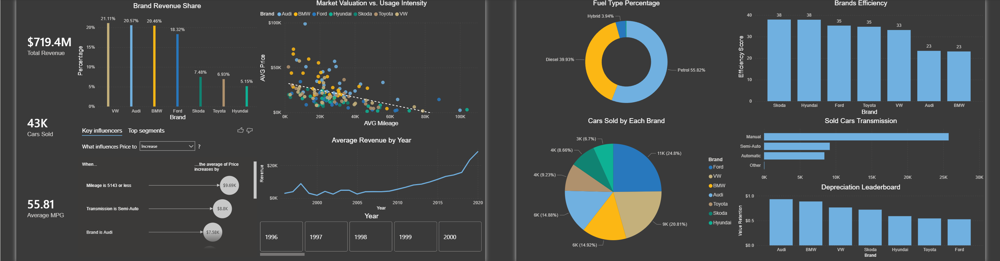

# Car Sales Interactive Dashboard 🚗

## Project Overview
This Power BI dashboard provides a comprehensive analysis of car sales performance. It tracks key KPIs such as total revenue, profit margins, and sales volume across different regions and car manufacturers.

## 📊 Dashboard Preview

## Key Insights
* **Sales Growth:** Identified a 12% Year-over-Year (YoY) increase in SUV sales.
* **Profitability:** Analyzed which car models yielded the highest profit margins despite lower sales volume.
* **Regional Trends:** Found that [Region Name] outperformed others by 20% in Q4.

## Technical Skills Used
* **DAX:** Created custom measures for YoY growth, rolling averages, and dynamic KPIs.
* **Power Query:** Cleaned and transformed raw sales data (handling missing dates and currency formatting).
* **Data Modeling:** Established a Star Schema with Fact and Dimension tables for optimized performance.
